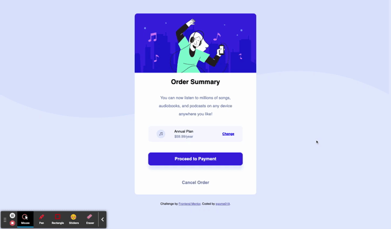

# Frontend Mentor - Order summary card solution

This is a solution to the [Order summary card challenge on Frontend Mentor](https://www.frontendmentor.io/challenges/order-summary-component-QlPmajDUj). Frontend Mentor challenges help you improve your coding skills by building realistic projects.

## Table of contents

- [Overview](#overview)
  - [The challenge](#the-challenge)
  - [Screenshot](#screenshot)
  - [Links](#links)
- [My process](#my-process)
  - [Built with](#built-with)
  - [What I learned](#what-i-learned)
  - [Continued development](#continued-development)
  - [Useful resources](#useful-resources)
- [Author](#author)

## Overview

### The challenge

Users should be able to:

- See hover states for interactive elements

### Screenshot



### Links

- Live Site URL: [Order Summary Component](https://egome019.github.io/order-summary-component-main/)

## My process

### Built with

- Semantic HTML5 markup
- CSS custom properties
- Flexbox
- Mobile-first workflow

### What I learned

I dove into CSS trying to solve the solution. In particular learning how to use Media Queries and Hover States. Researching both topics really helped in my understanding of how important both topics are to making a responsive website.

To see how you can add code snippets, see below:

```css
.content button:nth-of-type(1):hover {
	background-color: hsl(245, 83%, 68%, 1);
}
```

```css
@media screen and (max-width: 991.98) {
	background-color: hsl(245, 83%, 68%, 1);
}
```

### Continued development

I definitely need to continue learning about responsive design, but this time with a fully functional website. I need to really iron out CSS to avoid repetitive code. I also need to start adding some javascript to my web development base.

### Useful resources

- [Hover State](https://bitsofco.de/when-do-the-hover-focus-and-active-pseudo-classes-apply/) - This helped me learned hover state and introduce the focus and active pseudo-classes.
- [Media Queries](https://devfacts.com/media-queries-breakpoints-2021/) - This helped me choose the breakpoints for the media queries. It also helped me understand max-width and min-width a little better.

## Author

- Website - [Portfolio](https://egome019.github.io/)
- Frontend Mentor - [@egome019](https://www.frontendmentor.io/profile/egome019)
- LinkedIn - [Erik Gomez](https://www.linkedin.com/in/egomezwd/)
